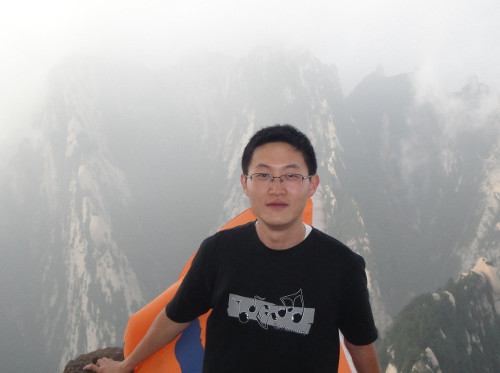

# Tao Zhang

>Ph.D. Student @

>[Computer Science Department](http://www.cs.stonybrook.edu) @

>[Stony Brook University](http://www.stonybrook.edu)

>Email: zhtao [AT] cs [DOT] stonybrook [DOT] edu

>My CV: *Not ready yet : (*

***

## About me

I'm a first year PhD student at Computer Science Department of Stony Brook University.
I'm currently working with [Prof. Donald Porter](http://www.cs.stonybrook.edu/~porter/) in [OSCAR lab](http://oscar.cs.stonybrook.edu/).

You can contact me via zhtao (at) cs.stonybrook.edu.

## Education
* M.S. in Computer Science, [Peking University](http://www.pku.edu.cn/), P.R.China, Jul. 2013
* B.S. in Computer Science, [Peking University](http://www.pku.edu.cn/), P.R.China, Jul. 2010

## Courses
* CSE502, Computer Architecture, Prof. Mike Ferdman, Spring 2014
* CSE532, Theory of Database Systems, Prof. Himanshu Gupta, Spring 2014
* CSE549, Computational Biology, Prof. Steven Skiena, Fall 2013
* CSE548, Analysis of Algorithm, Prof. Michael Bender, Fall 2013
* CSE506, Operating System, Prof. Mike Ferdman, Fall 2013

## Work Experience
### Teaching Assistant, Stony Brook University
* CSE591, Special Topics in Computer Science: Virtualization, Spring 2014
* CSE/ISE311, Systems Administration, Spring 2014
* CSE219, Computer Science III (Java Programming), Fall 2013
